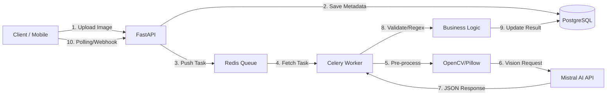

# Carte Grise OCR API

## Table of Contents
- [About](#about)
- [Features](#features)
- [Data Flow](#data-flow)
- [Technologies Used](#technologies-used)
- [Getting Started](#getting-started)
  - [Prerequisites](#prerequisites)
  - [Installation](#installation)
  - [Environment Variables](#environment-variables)
  - [Running with Docker Compose](#running-with-docker-compose)
- [Development](#development)
  - [Local Setup](#local-setup)
  - [Running Tests](#running-tests)
  - [Database Migrations](#database-migrations)
- [API Endpoints](#api-endpoints)
- [Folder Structure](#folder-structure)
- [Contributing](#contributing)
- [License](#license)

## About
This project implements a FastAPI backend application designed for Optical Character Recognition (OCR) and extraction of specific fields from car registration documents (cartes grises) for France (FR) and Tunisia (TN). It leverages AI (Mistral AI), image processing (OpenCV/Pillow), and a robust asynchronous task queue (Celery with Redis) to handle image uploads, process them, extract structured data, and store results in a PostgreSQL database.

## Features
-   **Image Upload**: Securely upload car registration document images.
-   **AI-Powered Extraction**: Utilize Mistral AI for intelligent field extraction from images.
-   **Country-Specific Processing**: Supports different prompt templates and validation rules for French and Tunisian car plates.
-   **Asynchronous Processing**: Celery workers handle heavy OCR tasks in the background, preventing API timeouts.
-   **Data Validation**: Regex and algorithmic validation of extracted data.
-   **RESTful API**: Provides endpoints for uploading images, checking task status, and retrieving extracted data.
-   **Database Storage**: Stores document metadata and extracted results in PostgreSQL.
-   **Authentication (Planned)**: JWT-based authentication for API users.
-   **Dockerized Environment**: Easy setup and deployment using Docker and Docker Compose.

## Data Flow
The application follows a clear data flow to ensure efficient and scalable processing:



## Technologies Used
-   **Backend Framework**: FastAPI
-   **Programming Language**: Python 3.12+
-   **Dependency Management**: Poetry
-   **Database**: PostgreSQL
-   **ORM**: SQLAlchemy
-   **Database Migrations**: Alembic
-   **Asynchronous Task Queue**: Celery
-   **Message Broker/Backend**: Redis
-   **AI/OCR**: Mistral AI API
-   **Image Processing**: OpenCV, Pillow
-   **Data Validation**: Pydantic
-   **Deployment/Orchestration**: Docker, Docker Compose

## Getting Started

### Prerequisites
Before you begin, ensure you have the following installed on your system:
-   [**Docker**](https://docs.docker.com/get-docker/)
-   [**Docker Compose**](https://docs.docker.com/compose/install/) (usually included with Docker Desktop)
-   [**Poetry**](https://python-poetry.org/docs/#installation) (for local development setup)

### Installation

1.  **Clone the repository**:
    ```bash
    git clone https://github.com/your-username/carte-grise-ocr.git
    cd carte-grise-ocr
    ```

2.  **Install Python dependencies (for local development/Poetry)**:
    If you plan to develop locally without Docker Compose, install dependencies using Poetry:
    ```bash
    poetry install --no-root
    ```

### Environment Variables
Create a `.env` file in the root directory of the project and populate it with your environment-specific values. A `.env` file example is provided:

```
DATABASE_URL="postgresql+psycopg2://user:password@db:5432/carte_grise_ocr_db"
MISTRAL_API_KEY="your_mistral_api_key" # Replace with your actual Mistral API Key
SECRET_KEY="super-secret-jwt-key" # Keep this secret and long in production
REDIS_BROKER_URL="redis://redis:6379/0"
REDIS_BACKEND_URL="redis://redis:6379/1"
```

**Note**: For `MISTRAL_API_KEY`, ensure you replace `"your_mistral_api_key"` with a valid API key from [Mistral AI](https://mistral.ai/).

### Running with Docker Compose
The recommended way to run the application and its services is using Docker Compose.

1.  **Build and start the services**:
    ```bash
    docker-compose up --build
    ```
    This command will:
    -   Build the `api` and `worker` Docker images.
    -   Start PostgreSQL (`db`), Redis (`redis`), FastAPI (`api`), and Celery Worker (`worker`) containers.
    -   Run database migrations automatically on the `api` service startup.

2.  **Access the API documentation**:
    Once the services are up, you can access the interactive API documentation (Swagger UI) at:
    `http://localhost:8000/docs`

3.  **Stop the services**:
    ```bash
    docker-compose down
    ```

## Development

### Local Setup
If you prefer to run the FastAPI application and worker directly (without Docker Compose for Python services, but still requiring Docker for `db` and `redis`):

1.  **Start only the database and Redis containers**:
    ```bash
    docker-compose up db redis
    ```

2.  **Activate Poetry virtual environment**:
    ```bash
    poetry shell
    ```

3.  **Run database migrations**:
    ```bash
    poetry run alembic upgrade head
    ```

4.  **Start the FastAPI application**:
    ```bash
    poetry run uvicorn app.main:app --host 0.0.0.0 --port 8000 --reload
    ```
    The `--reload` flag enables auto-reloading on code changes for development.

5.  **Start the Celery worker**:
    In a separate terminal, with the Poetry shell activated:
    ```bash
    poetry run celery -A app.core.celery_app worker -l info -P solo
    ```
    (Note: `-P solo` is for development; for production, consider a multi-process pool like `-P fork` or `-P gevent`).

### Running Tests
Unit and integration tests are set up using `pytest`.

1.  **Ensure you have dev dependencies installed**:
    ```bash
    poetry install
    ```
    (If `poetry install --no-root` was used, ensure dev dependencies are part of `pyproject.toml`).

2.  **Run all tests**:
    ```bash
    poetry run pytest
    ```
    Or to run specific tests:
    ```bash
    poetry run pytest tests/path/to/your_test_file.py
    ```

### Database Migrations
Alembic is configured for managing database schema changes.

1.  **Generate a new migration**:
    ```bash
    poetry run alembic revision --autogenerate -m "Description of changes"
    ```

2.  **Apply migrations**:
    ```bash
    poetry run alembic upgrade head
    ```

3.  **Revert migrations**:
    ```bash
    poetry run alembic downgrade -1
    ```

## API Endpoints

-   **`GET /api/v1/health`**: Checks the health status of the API, database, and Redis.
    -   **Response**: `{"status": "ok", "message": "All services are healthy"}` or an error detail.

-   **`POST /api/v1/upload-and-extract/`**: Uploads a car registration document image for OCR extraction.
    -   **Request Body**:
        -   `file`: The image file (multipart/form-data).
        -   `country_code`: String (e.g., "FR", "TN").
    -   **Response**: Returns `Document` metadata with a "pending" status. The actual extraction runs asynchronously.

-   **`GET /api/v1/task-status/{document_id}`**: Retrieves the current status and extracted data for a specific document.
    -   **Path Parameter**: `document_id` (Integer).
    -   **Response**: Returns `Document` details, including `status` and `extracted_data` (if available).

## Folder Structure

```
carte-grise-ocr/
├── app/
│   ├── __init__.py
│   ├── main.py                 # FastAPI application entry point
│   ├── api/                    # API routes
│   │   ├── v1/
│   │   │   ├── endpoints/
│   │   │   │   ├── extraction.py  # Image upload and task status
│   │   │   │   └── health.py      # Health check for services (DB, Redis, Mistral)
│   │   │   └── api.py             # Aggregates v1 routes
│   ├── core/                   # Global configuration
│   │   ├── config.py           # Environment variables (Mistral API Key, DB URL)
│   │   ├── security.py         # JWT / API Keys authentication logic
│   │   └── celery_app.py       # Celery client configuration
│   ├── database.py             # SQLAlchemy engine and session setup
│   ├── models/                 # Database models (SQLAlchemy)
│   │   ├── document.py         # History of scans and results
│   │   └── user.py             # API users
│   ├── schemas/                # Pydantic validation (Input/Output)
│   │   ├── common.py           # Shared schemas
│   │   ├── car_plate_fr.py     # French car plate schema
│   │   └── car_plate_tn.py     # Tunisian car plate schema
│   ├── services/               # Business logic
│   │   ├── ai/
│   │   │   ├── mistral_client.py # Mistral SDK wrapper
│   │   │   └── prompts.py       # Country-specific prompt templates
│   │   ├── image_processing.py # OpenCV / Pillow utilities (Resize, Grayscale)
│   │   └── validation.py       # Regex/algorithmic validation logic
│   └── worker/                 # Celery worker logic (Background tasks)
│       └── tasks.py            # @celery_app.task definitions
├── tests/                      # Unit and integration tests
├── alembic/                    # Database migrations (managed by Alembic)
├── storage/                    # Local temporary storage (if not using S3)
├── docker/                     # Dockerfiles (API, Worker)
│   ├── Dockerfile.api          # Dockerfile for the FastAPI service
│   └── Dockerfile.worker       # Dockerfile for the Celery worker service
├── .env                        # Environment variables (local settings)
├── docker-compose.yml          # Docker orchestration (API, Worker, Redis, Postgres)
├── pyproject.toml              # Project dependencies (Poetry)
└── alembic.ini                 # Alembic configuration
```

## Contributing
Contributions are welcome! Please follow these steps:
1.  Fork the repository.
2.  Create a new branch (`git checkout -b feature/your-feature-name`).
3.  Make your changes and ensure tests pass.
4.  Commit your changes (`git commit -m 'feat: Add new feature'`).
5.  Push to the branch (`git push origin feature/your-feature-name`).
6.  Open a Pull Request.

## License
This project is licensed under the MIT License - see the `LICENSE` file for details (if applicable, otherwise specify your license here).
